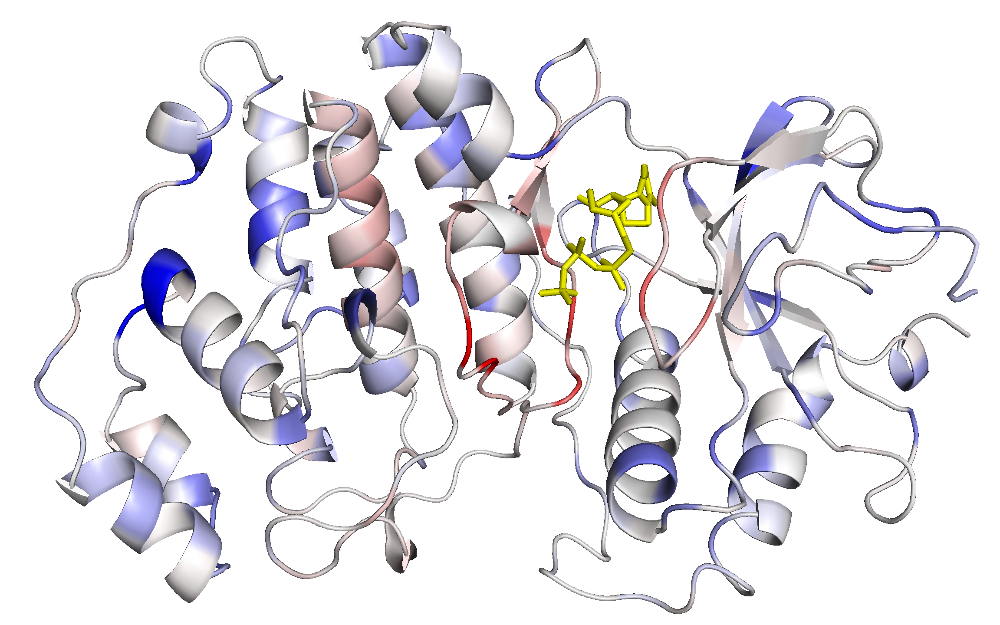

# DeeProtein
[](https://doi.org/10.5281/zenodo.1402828)
[](https://doi.org/10.5281/zenodo.1402817)

# Requirements

- [Python 3.5+](https://www.python.org/downloads/release/python-350/)
- [Cuda 8.0+](https://developer.nvidia.com/cuda-80-ga2-download-archive)
- [Tensorflow 1.4+](https://www.tensorflow.org/api_docs/)
- [Tensorlayer 1.5.4+](http://tensorlayer.readthedocs.io/en/latest/)
- [GO-Tools](https://github.com/tanghaibao/goatools)
- [PyMOL 1.7+](https://pymol.org/2/)
- [BioPython 1.7.4](https://biopython.org/)
- [SciPy 0.19](http://www.scipy.org/install.html)
- [Pandas 0.20](https://pandas.pydata.org/pandas-docs/stable/index.html)
- [scikit-learn 0.19](http://scikit-learn.org/stable/install.html#)

# General Information

## Sensitivity data
Sensitivity data is stored in our [zenodo repository](https://doi.org/10.5281/zenodo.1402817)

## DeeProtein Weights
Weights for DeeProtein are stored in our [zenodo repository](https://doi.org/10.5281/zenodo.1402828)

# Setup

Download the GeneOntology
```bash
$ wget http://purl.obolibrary.org/obo/go.obo
```

Clone this git repository:
   ```bash
   $ git clone https://github.com/juzb/DeeProtein && cd DeeProtein
   ```

# Usage

## Analysis of published Datasets in PyMOL

Obtain sensitivity values from our [zenodo repository](https://doi.org/10.5281/zenodo.1402817).

```bash
$ wget https://zenodo.org/record/1402817/files/data.tar.gz
$ tar -xvzf data.tar.gz
```

To visualize sensitivity analysis data on a given protein sequence:

   If the module is used for the first time, the following paths have to be specified in `visualize_sensitivity.py`:

   * label_path   -> Path to the sensitivity data. Accessible in our [zenodo repository](https://doi.org/10.5281/zenodo.1402817)
   * save_path    -> Path to save the outputs produced by the script
   * godag_path   -> Path to gene-ontology.obo file (downloaded before)
   * prot_path    -> Path to the PDB files. They are downloaded automatically when needed.

   ```bash
   $ vim visualize_sensitivity.py
   ```

   After that the results can be visualized in PyMOL. The script is called from the PyMOL console:

   ```bash
   $ PyMOL
   PyMOL> run path/to/DeeProtein/scripts/visualize_sensitivity.py
   ```

   This adds a few new commands to PyMOL:

   ```python
   PyMOL> color_sensitivity(save_png=False, next_dp=False, file=None, category=None, only='bind', show_hetatm=True, show_chains=False, lig=None)
   ```

   Use to automatically color a structure by sensitivity. Is called from the PyMOL console.
   If the 3D structure needed to show a given proteins sensitivity is not
   available in the specified 'prot_path', the PDB file is automatically downloaded.

   * **save_png**        if True saves a PNG of the current view at the next call. **IMPORTANT:** the current view will
                            only be saved at the next call.
   * **next_dp**         jumps to next file at the next call. Conflicts with the 'file' parameter, always shows the
                            first category then.
   * **file**            filename of the label file to use. None selects one from the specified label path
   * **category**        column to color the structure with. None selects one from the current file
   * **only**            cycles trough columns that contain information to what is specified here, options are:
        * *a GO term*    -> shows the sensitivity for that, the sphere variance, whatever is available
        * *'bind'*       -> shows sensitivity for GO terms which contain 'bind' in their name
        * *'sen'*        -> only sensitivity columns
        * *'svar'*       -> only shows sphere variance columns
   * **show_hetatm**     Whether to show heteroatoms (like ligands)
   * **show_chains**     Can be False, shows no chains except for the one with sensitivity data.
                            Can be True, shows all chains, the ones without sensitivity data in orange.
                            Can be a nested list like '\[\['A', 'orange'], \['C', 'yellow'], \['D', 'yellow']]',
                            each element in the list must be a list with two elements: A single letter specifying the
                            chain and a string that is a valid color for PyMOL.
   * **lig**             Ligand identifier. If specified the distance of all residues to that ligand is calculated
                            and written to the savepath as a new column in the current label file. The ligand identifier
                            can be determined as follows:
        1. Click on the ligand
        2. The Console will show something like 'You clicked   /5VW1//C/PG4`102/O4'
        3. Copy the part from the first to the last '/', like '/5VW1//C/PG4`102/'
        4. Paste

   ```python
   reset_stored()
   ```
   Resets the memory for color_sensitivity(). Use in case anything goes wrong.

   ```python
   picture(name)
   ```
   Take a picture of the current view. Provide the name of of the picture. For example:
   

## Inference with DeeProtein

Download the weights for DeeProtein from our [zenodo repository](https://doi.org/10.5281/zenodo.1402828)
```bash
$ wget https://zenodo.org/record/1402828/files/complete_model_0.npz
mv complete_model_0.npz complete_model.npz
```

1. Specify the options in config.JSON, see FLAGS explanations at the end of this Readme.
   ```bash
   $ vim config.JSON
   ```
   Alternatively, options can be superseded by specifying the appropriate FLAG in the function call (as seen below).

3. To infer a sequence on the pretrained DeeProtein Model:
   Run DeeProtein in interactive inference mode:
   ```bash
   $ python DeeProtein.py -infer=True -restore=True -restorepath=path/to/saves -model_to_use=model/model.py -batchsize=1
   ```

   The network will import its weights from the specified file path (`restorepath`) in `config.JSON` and start the interactive inference mode:
   ```bash
   > Enter Sequence for Classification:
   ```
   Enter for example:
   ```bash
   SMAAAAAAGAGPEMVRGQVFDVGPRYTNLSYIGEGAYGMVCSAYDNVNKVRVAIKKISPFEHQTYCQRTLREIKILLRFRHENIIGINDIIRAPTIEQMKDVYIVQDLMETDLYKLLKTQHLSNDHICYFLYQILRGLKYIHSANVLHRDLKPSNLLLNTTCDLKICDFGLARVADPDHDHTGFLTEYVATRWYRAPEIMLNSKGYTKSIDIWSVGCILAEMLSNRPIFPGKHYLDQLNHILGILGSPSQEDLNCIINLKARNYLLSLPHKNKVPWNRLFPNADSKALDLLDKMLTFNPHKRIEVEQALAHPYLEQYYDPSDEPIAEAPFKFDMELDDLPKEKLKELIFEETARFQPGYRS
   ```
   and DeeProtein will print the top 20 GO-terms for the entered sequence:

   ```bash
    > Predicted labels:
    > -----------------

    > GO-Term		Score	Explanation
    > GO:0003674	1.000	molecular_function
    > GO:0003824	1.000	catalytic activity
    > GO:0005488	1.000	binding
    > GO:0043167	1.000	ion binding
    > GO:0097159	1.000	organic cyclic compound binding
    > GO:1901363	1.000	heterocyclic compound binding
    > GO:0036094	1.000	small molecule binding
    > GO:1901265	1.000	nucleoside phosphate binding
    > GO:0000166	1.000	nucleotide binding
    > GO:0043168	1.000	anion binding
    > GO:0097367	1.000	carbohydrate derivative binding
    > GO:0032553	1.000	ribonucleotide binding
    > GO:0016740	1.000	transferase activity
    > GO:0017076	1.000	purine nucleotide binding
    > GO:0032555	1.000	purine ribonucleotide binding
    > GO:0035639	1.000	purine ribonucleoside triphosphate binding
    > GO:0030554	1.000	adenyl nucleotide binding
    > GO:0032559	1.000	adenyl ribonucleotide binding
    > GO:0005524	1.000	ATP binding
    > GO:0005515	0.999	protein binding
    > GO:0016772	1.000	transferase activity, transferring phosphorus-containing groups
    > GO:0016301	1.000	kinase activity
    > GO:0016773	1.000	phosphotransferase activity, alcohol group as acceptor
    > GO:0004871	1.000	signal transducer activity
    > GO:0019899	1.000	enzyme binding
    > GO:0004672	1.000	protein kinase activity
    > GO:0004674	1.000	protein serine/threonine kinase activity
    > GO:0008134	1.000	transcription factor binding
    > GO:0019900	0.985	kinase binding
    > GO:0019901	0.866	protein kinase binding
    > GO:0019902	1.000	phosphatase binding
    > GO:0005057	1.000	signal transducer activity, downstream of receptor
    > GO:0004702	1.000	signal transducer, downstream of receptor, with serine/threonine kinase activity
    > GO:0019903	0.935	protein phosphatase binding
   ```


## Sensitivity Analysis

1. Write a masked_dataset.txt file having the following format:
   Each line consists of
   ```txt
    <PDB ID>;<Chain ID>;<GO:1>,<GO:2>, ...;<Sequence>;<Secondary structure>;<dis string>
   ```

   e.g.

   ```txt
    3KY9;A;GO:0051056,GO:0009966,GO:0050794,GO:1902531,GO:0050789,GO:0010646,GO:0007264,GO:0009987,GO:0065007,GO:0098772,GO:0003674,GO:0035023,GO:0007165,GO:0005088,GO:0023051,GO:0048583,GO:0035556,GO:0005089,GO:0008150,GO:0005085,GO:0046578;GHMKELWRQCTHWLIQCRVLPPSHRVTWEGAQVCELAQALRDGVLLCQLLNNLLPHAINLREVNLRPQMSQFLCLKNIRTFLSTCCEKFGLKRSELFEAFDLFDVQDFGKVIYTLSALSWTPIAQNRGIMPFPTEEESVGDEDIYSGLSDQIDDTVEEDEDLYDCVENEEAEGDEIYEDLMRSEPVSMPPKMTEYDKRCCCLREIQQTEEKYTDTLGSIQQHFLKPLQRFLKPQDIEIIFINIEDLLRVHTHFLKEMKEALGTPGAANLYQVFIKYKERFLVYGRYCSQVESASKHLDRVAAAREDVQMKLEECSQRANNGRFTLRDLLMVPMQRVLKYHLLLQELVKHTQEAMEKENLRLALDAMRDLAQCVNEVKRDNETLRQITNFQLSIENLDQSLAHYGRPKIDGELKITSVERRSKMDRYAFLLDKALLICKRRGDSYDLKDFVNLHSFQVRDDSSGDRDNKKWSHMFLLIEDQGAQGYELFFKTRELKKKWMEQFEMAISNIYPENATANGHDFQMFSFEETTSCKACQMLLRGTFYQGYRCHRCRASAHKECLGRVPPCGRHGQDFPGTMKKDKLHRRA;.....HHHHHHHHHHHTT.S.TTSTTTSTT..HHHHHHHHSSTHHHHHHHHHHSTTSS.GGGS.SS.TTBHHHHHHHHHHHHHHHHHTT...TTSS..HHHHHT.S.HHHHHHHHHHHHHSTTTGGGT.................TTHHHHH.......TTGGGGS..TTHHHHHHHHHHH............TTHHHHHHHHHHHHHHHHHHHHHHHHHHHTHHHHHTTS.TTTSHHHHHHHHHHHHHHHHHHHHHHHHHHSSTT.SHHHHHHHTTTGGGHHHHHHHHHHHHHHHHHHHHHT.HHHHTTTTHHHHHHHSSS..HHHHHHHHHHHHTTHHHHHHHHHHT...HHHHHHHHHHHHHHHHHHHHHHHHHHHHHHHHHHHHHHHHEET..S.GGGG..EEEEEEEEEE.SS..S.EEEEEEEETTEEEEEEEETTEEEEEEEEEGGGEEEEE.........TT.EEEEEEETT.....EEEESSHHHHHHHHHHHHHHHHHHS.TTTTGGG..EEEE..SS..B.TTT.SB..SSS..EEEETTT..EE.SGGGGGS.......................;XXXX--------------------------------------------------------------------------------------------------------------------------------XXXXXXXXXXXX---------XXXXX-------------------------XXXXXXXX-----------------------------------------------------------------------------------------------------------------------------------------------------------------------------------------------------------------------------------------------------------------------------XXXXX----------------XXX-----------------------------------------------------------------------------------XXXXXXXXXXXXXXXXXXXX
   ```

   where, sequence, secondary structure and dis string are of the same length.
   If the secondary structure is unknown a string containing only points is valid.
   If the dis string is unknown, a string containing only underscores is valid.


2. Score the occluded sequences using

   ```bash
   $ python DeeProtein.py -mask=True -restore=True -restorepath=path/to/saves -model_to_use=model/model.py -v path/to/test/parent-directory-of-masked_dataset
   ```

3. Optional, if using multiple replicates, repeat 2. for each of them, ideally such that the written 'impact' directories are in the
   same parent directory and have numbers: impact_1, impact_2, ...
   Combine the masked dumps, i.e. the sensitivity values using

   ```bash
   $ python post_processing/combine_masked_dumps.py /path/to/directory/with/impact-directories
   ```

# FLAGS

A number of FLAGS is available in `config.JSON` to specify the behavior of DeeProtein, both for inference and training.
While all FLAGS may be superseded in the function calls, we recommend to set up the config.JSON prior to usage:

FOR INFERENCE AND SENSITIVITY ANALYSIS:
* `info_path`        `str, the path where logs and the metrics calculation related files should be saved
* `infer`        'str', either `True` or `False` (as 'str'), whether to run the model in inference mode.
* `mask`        'str', either `True` or `False` (as 'str'), if `True` enables the model to perform sensitivity analysis on a masked dataset specified in `validdata`
* `restorepath`        'str', path to directory which contains a complete_model.npz file, the saves from which to restore the model
* `print_all`        'str', either `True` or `False` (as 'str'), whether to print ALL (1000) Go term scores in interactive inference. if `False` only the top 20 are printed.
* `restore`        'str', either `True` or `False` (as 'str'), whether to restore the model from `restorepath` or train a new model. Defaults to `True`
* `godagfile`        'str', the path to the Gene-Ontology .obo file
* `gofile`        'str', the path to file specifying the GO-terms the model should consider. One GO per line. Available in data/go_file_1000.txt
* `pdbpath`        `str, the path to the file containing pdb IDs, secondary structure, annotation size info.
* `pfampath`        `str, the path to the pfam directory containing the pfam2pdb file.

FOR TRAINING A NEW MODEL:
* `validdata`        'str', the path to the datasets as .csv. Alternative use in 'mask' mode (i.e. sensitivity analysis): path to masked dataset file
* `traindata`        'str', the path to the datasets as .csv
* `test`        'str', either `True` or `False` (as 'str'), whether to activate test mode. Test data to be specified under `validdata`
* `compare`        'str', either `True` or `False` (as 'str'), Compares multiple models based on their dumps, paths specified comma-separated in `validdata`
* `model_to_use`        'str', the path to the .py holding the model to use in DeeProtein. Default: `model/model.py`
* `logging_level`        'str', One of \[INFO, DEBUG, WARNING\] the basic level on which the logger should operate.
* `modelname`        'str', the name of the Model. Default 'DeeProtein'
* `nblocks`        'int', number of residual blocks to build. Defaults to 30, given weights do only comply with that number.
* `print_num_params`        'str', either `True` or `False` (as 'str'). Printing the number of parameters is time intensive but interesting. Choose wisely...
* `windowlength`        'int', Max. Number of sequence position to consider. Longer sequences are clipped. Defaults to `1000`.
* `learningrate`        'float', initial learning rate for the training of DeeProtein
* `epsilon`        'float', epsilon parameter for the ADAM optimizer
* `batchsize`        'int', batchsize. We recommend 64 for training. Defaults to `1` (for inference).
* `nepochs`        'int', number of epochs to train the model. Defaults to `20`.
* `valid_after`        'int', number of batches after which to perform an early run over the valid set.
* `early_valid_size`        'int', number of batches to use in early validation
* `keep_plots`        'str', either `True` or `False` (as 'str'), whether to keep or overwrite plots from each validation run

