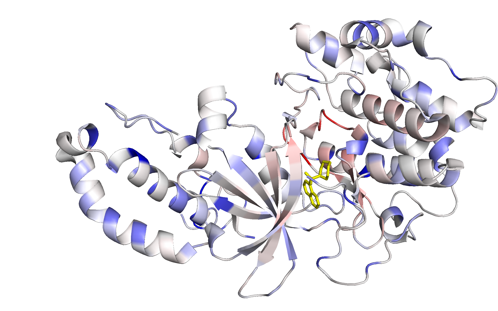

# DeeProtein
[](https://doi.org/10.5281/zenodo.1402828)
[](https://doi.org/10.5281/zenodo.1402817)

[Github repository](https://github.com/juzb/DeeProtein)

[Code ocean compute capsule]()

Software for "Leveraging Implicit Knowledge in Neural Networks for Functional Dissection and Engineering of Proteins"


# Online Mode

With just a few clicks, you can run DeeProtein online in our code ocean compute capsule. To do so, you need to sign up and duplicate this capusule. In the duplicate choose the 'Interface' tab and follow the instructions below.

This compute capsule includes:
* **Classfication:** determine the functions of any protein sequence
* **Sensitivity analysis:** run a full sensitivity analysis for a set of GO terms for any protein sequence

More detailed instructions for running the inference and sensitivity analysis in online mode via our compute capsule can be found in the [usage section](#usage).


## Classification

Fill in the parameters.
1. **Sequence**, the sequence to analyse in a single line without whitespaces
2. **GO terms to analyse**, is ignored for the inference mode
3. **Type**, has to be "C" for classification

Click **Run** and wait for the results. This can take a few minutes.

The results of the classification show up in the Results field.

The first column is the GO term, the second one its score between 0.0 and 1.0, and the third one contains the full name of the GO term.

**Example:**

For the Sequence of rho-kinase kinase domain ([PDB 2F4U](https://www.rcsb.org/structure/2f2u))

```bash
GASGDGAGASRQRKLEALIRDPRSPINVESLLDGLNSLVLDLDFPALRKNKNIDNFLNRYEKIVKKIRGLQMKAEDYDVVKVIGRGAFGEVQLVRHKASQKVYAMKLLSKFEMIKRSDSAFFWEERDIMAFANSPWVVQLFCAFQDDKYLYMVMEYMPGGDLVNLMSNYDVPEKWAKFYTAEVVLALDAIHSMGLIHRDVKPDNMLLDKHGHLKLADFGTCMKMDETGMVHCDTAVGTPDYISPEVLKSQGGDGYYGRECDWWSVGVFLFEMLVGDTPFYADSLVGTYSKIMDHKNSLCFPEDAEISKHAKNLICAFLTDREVRLGRNGVEEIKQHPFFKNDQWNWDNIRETAAPVVPELSSDIDSSNFDDIEDDKGDVETFPIPKAFVGNQLPFIGFTYYR
```

the following predictions are made

```txt
Predicted labels:
-----------------

GO-Term		Score	Explanation
GO:0003674	1.000	molecular_function
GO:0004672	1.000	protein kinase activity
GO:0005524	1.000	ATP binding
GO:0032559	1.000	adenyl ribonucleotide binding
GO:0030554	1.000	adenyl nucleotide binding
GO:0035639	1.000	purine ribonucleoside triphosphate binding
GO:0032555	1.000	purine ribonucleotide binding
GO:0017076	1.000	purine nucleotide binding
GO:0016740	1.000	transferase activity
GO:0032553	1.000	ribonucleotide binding
GO:0016301	1.000	kinase activity
GO:0097367	1.000	carbohydrate derivative binding
GO:0016773	1.000	phosphotransferase activity, alcohol group as acceptor
GO:0016772	1.000	transferase activity, transferring phosphorus-containing groups
GO:0043168	1.000	anion binding
GO:0000166	1.000	nucleotide binding
GO:0004674	1.000	protein serine/threonine kinase activity
GO:1901265	1.000	nucleoside phosphate binding
GO:0036094	1.000	small molecule binding
GO:1901363	1.000	heterocyclic compound binding
GO:0097159	1.000	organic cyclic compound binding
GO:0043167	1.000	ion binding
GO:0005488	1.000	binding
GO:0003824	1.000	catalytic activity
--------------------------------------------------
GO:0098772	0.003	molecular function regulator
GO:0004683	0.001	calmodulin-dependent protein kinase activity
```

**Note:** When working with many sequences, you can speed up the inference
using a terminal on code ocean. This is described in the section [Online inference of multiple sequences](#online-inference-of-multiple-sequences).

## Sensitivity Analysis

Fill in the parameters.
1. **Sequence**, the sequence to analyse in a single line without whitespaces
2. **GO terms to analyse**, has to be a comma-separated list of of GO terms without whitespaces. Only GO terms the model was trained for are analysed. A list of these is available in `examples/go_file_1000.txt`.
3. **Type**, has to be "S" for sensitivity analysis

Click **Run** and wait for the results. This can take a few minutes.

The results of the sensitivity analysis show up in the Results field.

**Example:**

For the Sequence of rho-kinase kinase domain

```bash
QRKLEALIRDPRSPINVESLLDGLNSLVLDLDFPALRKNKNIDNFLNRYEKIVKKIRGLQMKAEDYDVVKVIGRGAFGEVQLVRHKASQKVYAMKLLSKFEMIKRSDSAFFWEERDIMAFANSPWVVQLFCAFQDDKYLYMVMEYMPGGDLVNLMSNYDVPEKWAKFYTAEVVLALDAIHSMGLIHRDVKPDNMLLDKHGHLKLADFGTCMKMDETGMVHCDTAVGTPDYISPEVLKSQGGDGYYGRECDWWSVGVFLFEMLVGDTPFYADSLVGTYSKIMDHKNSLCFPEDAEISKHAKNLICAFLTDREVRLGRNGVEEIKQHPFFKNDQWNWDNIRETAAPVVPELSSDIDSSNFDDITFPIPKAFVGNQLPFIGFTYYR
```

and the following GO terms

```bash
GO:0004672,GO:0005524,GO:0016740
```

the following results are obtained

```bash
Pos	AA	sec	dis	GO:0004672	GO:0005524	GO:0016740
-1	wt	wt	wt	0.0	0.0	0.0
0	Q	.	_	0.260921	0.373787	-0.39344
1	R	.	_	0.258875	0.0737915	-0.597622
2	K	.	_	0.43105	-0.125195	-0.661755
3	L	.	_	0.49213	0.321846	-0.76186
4	E	.	_	-0.635345	1.35973	1.21021
5	A	.	_	0.0190907	0.185513	-0.00788879
6	L	.	_	0.260934	0.458355	-0.366749
7	I	.	_	0.223543	0.396866	0.367352
8	R	.	_	-0.142843	1.24622	-0.0176544
9	D	.	_	0.050931	0.0144348	0.372978
...
```

**Note:** The output has more than 400 lines and was truncated here.

Each Line contains information about one position in the protein sequence.
Its index is given under **Pos** and the respective amino acid under **AA**.
For each GO term **GO:_______**, there is one column containing the sensitivity value
in that position for that GO term.
The second line and the third and fourth columns ("sec", "dis") are for technical reasons and can be ignored.

**Note** Sequences far off the protein sequence space as covered by SwissProt might give unexpected results. The same applies to very short sequences since DeeProtein was trained on sequences with more than 150 amino acids.

# Visualization in PyMOL

For visualization of the sensitivity data, we provide a plugin for PyMOL.
You need PyMOL installed on your computer and our plugin to perform the
visualization.

The files containing the senstivity values need to be stored in the directory
specified in the `visualize_sensitvity.py` plugin.
Their name must follow this scheme

```txt
masked_<PDB IDENTIFIER>_<CHAIN IDENTIFIER>_1.txt
```

If this is the first use, please refer to the [setup section](#setup) for getting the plugin.

Obtain sensitivity values from your analysis on code ocean or from [zenodo repository](https://doi.org/10.5281/zenodo.1402817).

```bash
$ wget https://zenodo.org/record/1402817/files/data.tar.gz
$ tar -xvzf data.tar.gz
```

To visualize sensitivity analysis data on a given protein sequence:

   Activate the plugin in PyMol:

   ```bash
   $ PyMOL
   PyMOL> run path/to/DeeProtein/scripts/visualize_sensitivity.py
   ```


   **Example**

   Assuming you saved the results.txt file from the sensivitiy analysis
   in the label directory of the `visualize_sensitivity.py` plugin under the name `masked_2F2U_B_1.txt`.

   Running the following command

   ```python
   PyMOL> color_sensitivity(file="masked_2F2U_B_1.txt", category="GO:0005524", show_hetatm=True)
   ```

   visualizes the sensitivity values of GO:0005085, 'guanyl-nucleotide exchange factor activity'.
   After choosing a good view run

   ```python
   PyMOL> picture("example.png")
   ```

   to take a picture. You will find it in the `saves` directory of the plugin.

   

For details see the section [Visualization in PyMOL](#visualization-in-pymol).

# Online inference of multiple sequences

When working with many sequences, you can also launch a terminal on
code ocean in which you can run DeeProtein. This allows to keep
DeeProtein in memory when moving over to the next sequence and significantly
decreases the total computation time.

1. Change to code oceans preview of the new version
2. Click "launch an interactive session"
3. Choose "Launch Terminal"
4. Wait for the terminal to be ready and
5. Open it by clicking "interactive session"
6. The terminal opens in a new tab
7. Enter
    ```bash
    $ bash infer.sh
    ```
8. After DeeProtein is initialized, it will ask you to enter a sequence for classification
   ```txt
   > Enter Sequence for Classification:
   ```
9. When you enter a sequence and submit, the classification is performed,
the results are shown and you jump back to 8.

The results are the same as via the interface.
However, in the terminal the next sequence is immediately classified without
reinitializing DeeProtein.


# Setup

This and the following sections describe how to setup and deploy DeeProtein.

Download the GeneOntology
```bash
$ wget http://purl.obolibrary.org/obo/go.obo
```

Clone this git repository:
   ```bash
   $ git clone https://github.com/juzb/DeeProtein && cd DeeProtein
   ```


## Requirements

- [Python 3.5+](https://www.python.org/downloads/release/python-350/)
- [Cuda 8.0+](https://developer.nvidia.com/cuda-80-ga2-download-archive)
- [Tensorflow 1.4+](https://www.tensorflow.org/api_docs/)
- [Tensorlayer 1.5.4+](http://tensorlayer.readthedocs.io/en/latest/)
- [GO-Tools](https://github.com/tanghaibao/goatools)
- [PyMOL 1.7+](https://pymol.org/2/)
- [BioPython 1.7.4](https://biopython.org/)
- [SciPy 0.19](http://www.scipy.org/install.html)
- [scikit-learn 0.19](http://scikit-learn.org/stable/install.html#)

## General Information

**Sensitivity data**
Sensitivity data is stored in our [zenodo repository](https://doi.org/10.5281/zenodo.1402817).

**DeeProtein Weights**
Weights for DeeProtein are stored in our [zenodo repository](https://doi.org/10.5281/zenodo.1402828).


# Usage


## Inference with DeeProtein

Download the weights for DeeProtein from our [zenodo repository](https://doi.org/10.5281/zenodo.1402828)
```bash
$ wget https://zenodo.org/record/1402828/files/complete_model_0.npz
mv complete_model_0.npz complete_model.npz
```

1. Specify the options in config.JSON, see [FLAGS explanations](#flags).
   ```bash
   $ vim config.JSON
   ```
   Alternatively, options can be superseded by specifying the appropriate FLAG in the function call (as seen below).

3. To infer a sequence on the pretrained DeeProtein Model:
   Run DeeProtein in interactive inference mode:
   ```bash
   $ python DeeProtein.py -infer=True -restore=True -restorepath=path/to/saves -model_to_use=model/model.py -batchsize=1
   ```

   The network will import its weights from the specified file path (`restorepath`) in `config.JSON` and start the interactive inference mode:
   ```txt
   > Enter Sequence for Classification:
   ```
   Enter for example the rho-kinase kinase domain sequence:
   ```txt
   QRKLEALIRDPRSPINVESLLDGLNSLVLDLDFPALRKNKNIDNFLNRYEKIVKKIRGLQMKAEDYDVVKVIGRGAFGEVQLVRHKASQKVYAMKLLSKFEMIKRSDSAFFWEERDIMAFANSPWVVQLFCAFQDDKYLYMVMEYMPGGDLVNLMSNYDVPEKWAKFYTAEVVLALDAIHSMGLIHRDVKPDNMLLDKHGHLKLADFGTCMKMDETGMVHCDTAVGTPDYISPEVLKSQGGDGYYGRECDWWSVGVFLFEMLVGDTPFYADSLVGTYSKIMDHKNSLCFPEDAEISKHAKNLICAFLTDREVRLGRNGVEEIKQHPFFKNDQWNWDNIRETAAPVVPELSSDIDSSNFDDITFPIPKAFVGNQLPFIGFTYYR
   ```
   and DeeProtein will print the GO-terms for the entered sequence with a score higher than 0.0005:


    ```txt
    Predicted labels:
    -----------------

    GO-Term		Score	Explanation
    GO:0003674	1.000	molecular_function
    GO:0004672	1.000	protein kinase activity
    GO:0005524	1.000	ATP binding
    GO:0032559	1.000	adenyl ribonucleotide binding
    GO:0030554	1.000	adenyl nucleotide binding
    GO:0035639	1.000	purine ribonucleoside triphosphate binding
    GO:0032555	1.000	purine ribonucleotide binding
    GO:0017076	1.000	purine nucleotide binding
    GO:0016740	1.000	transferase activity
    GO:0032553	1.000	ribonucleotide binding
    GO:0016301	1.000	kinase activity
    GO:0097367	1.000	carbohydrate derivative binding
    GO:0016773	1.000	phosphotransferase activity, alcohol group as acceptor
    GO:0016772	1.000	transferase activity, transferring phosphorus-containing groups
    GO:0043168	1.000	anion binding
    GO:0000166	1.000	nucleotide binding
    GO:0004674	1.000	protein serine/threonine kinase activity
    GO:1901265	1.000	nucleoside phosphate binding
    GO:0036094	1.000	small molecule binding
    GO:1901363	1.000	heterocyclic compound binding
    GO:0097159	1.000	organic cyclic compound binding
    GO:0043167	1.000	ion binding
    GO:0005488	1.000	binding
    GO:0003824	1.000	catalytic activity
    --------------------------------------------------
    GO:0098772	0.003	molecular function regulator
    GO:0004683	0.001	calmodulin-dependent protein kinase activity
    ```


## Sensitivity Analysis

1. Write a masked_dataset.txt file having the following format:
   Each line consists of
   ```txt
    <PDB ID>;<Chain ID>;<GO:1>,<GO:2>, ...;<Sequence>;<Secondary structure>;<dis string>
   ```

   e.g.

   ```txt
    2F2U;B;GO:0004672,GO:0005524,GO:0016740;QRKLEALIRDPRSPINVESLLDGLNSLVLDLDFPALRKNKNIDNFLNRYEKIVKKIRGLQMKAEDYDVVKVIGRGAFGEVQLVRHKASQKVYAMKLLSKFEMIKRSDSAFFWEERDIMAFANSPWVVQLFCAFQDDKYLYMVMEYMPGGDLVNLMSNYDVPEKWAKFYTAEVVLALDAIHSMGLIHRDVKPDNMLLDKHGHLKLADFGTCMKMDETGMVHCDTAVGTPDYISPEVLKSQGGDGYYGRECDWWSVGVFLFEMLVGDTPFYADSLVGTYSKIMDHKNSLCFPEDAEISKHAKNLICAFLTDREVRLGRNGVEEIKQHPFFKNDQWNWDNIRETAAPVVPELSSDIDSSNFDDITFPIPKAFVGNQLPFIGFTYYR;...............................................................................................................................................................................................................................................................................................................................................................................................;_______________________________________________________________________________________________________________________________________________________________________________________________________________________________________________________________________________________________________________________________________________________________________________________________
   ```

   where, sequence, secondary structure and dis string are of the same length.
   If the secondary structure is unknown a string containing only points is valid.
   If the dis string is unknown, a string containing only underscores is valid.


2. Score the occluded sequences using

   ```bash
   $ python DeeProtein.py -mask=True -restore=True -restorepath=path/to/saves -model_to_use=model/model.py -v path/to/test/parent-directory-of-masked_dataset
   ```

3. Optional, if using multiple replicates, repeat 2. for each of them, ideally such that the written 'impact' directories are in the
   same parent directory and have numbers: impact_1, impact_2, ...
   Combine the masked dumps, i.e. the sensitivity values using

   ```bash
   $ python post_processing/combine_masked_dumps.py /path/to/directory/with/impact-directories
   ```

# FLAGS

A number of FLAGS is available in `config.JSON` to specify the behavior of DeeProtein, both for inference and training.
While all FLAGS may be superseded in the function calls, we recommend to set up the config.JSON prior to usage:

FOR INFERENCE AND SENSITIVITY ANALYSIS:
* `info_path`        `str, the path where logs and the metrics calculation related files should be saved
* `infer`        'str', either `True` or `False` (as 'str'), whether to run the model in inference mode.
* `mask`        'str', either `True` or `False` (as 'str'), if `True` enables the model to perform sensitivity analysis on a masked dataset specified in `validdata`
* `restorepath`        'str', path to directory which contains a complete_model.npz file, the saves from which to restore the model
* `print_all`        'str', either `True` or `False` (as 'str'), whether to print ALL (1000) Go term scores in interactive inference. if `False` only the top 20 are printed.
* `restore`        'str', either `True` or `False` (as 'str'), whether to restore the model from `restorepath` or train a new model. Defaults to `True`
* `godagfile`        'str', the path to the Gene-Ontology .obo file
* `gofile`        'str', the path to file specifying the GO-terms the model should consider. One GO per line. Available in examples/go_file_1000.txt
* `pdbpath`        `str, the path to the file containing pdb IDs, secondary structure, annotation size info.
* `pfampath`        `str, the path to the pfam directory containing the pfam2pdb file.

FOR TRAINING A NEW MODEL:
* `validdata`        'str', the path to the datasets as .csv. Alternative use in 'mask' mode (i.e. sensitivity analysis): path to masked dataset file
* `traindata`        'str', the path to the datasets as .csv
* `test`        'str', either `True` or `False` (as 'str'), whether to activate test mode. Test data to be specified under `validdata`
* `compare`        'str', either `True` or `False` (as 'str'), Compares multiple models based on their dumps, paths specified comma-separated in `validdata`
* `model_to_use`        'str', the path to the .py holding the model to use in DeeProtein. Default: `model/model.py`
* `logging_level`        'str', One of \[INFO, DEBUG, WARNING\] the basic level on which the logger should operate.
* `modelname`        'str', the name of the Model. Default 'DeeProtein'
* `nblocks`        'int', number of residual blocks to build. Defaults to 30, given weights do only comply with that number.
* `print_num_params`        'str', either `True` or `False` (as 'str'). Printing the number of parameters is time intensive but interesting. Choose wisely...
* `windowlength`        'int', Max. Number of sequence position to consider. Longer sequences are clipped. Defaults to `1000`.
* `learningrate`        'float', initial learning rate for the training of DeeProtein
* `epsilon`        'float', epsilon parameter for the ADAM optimizer
* `batchsize`        'int', batchsize. We recommend 64 for training. Defaults to `1` (for inference).
* `nepochs`        'int', number of epochs to train the model. Defaults to `20`.
* `valid_after`        'int', number of batches after which to perform an early run over the valid set.
* `early_valid_size`        'int', number of batches to use in early validation
* `keep_plots`        'str', either `True` or `False` (as 'str'), whether to keep or overwrite plots from each validation run


# Visualization in PyMOL

   ```python
   PyMOL> color_sensitivity(save_png=False, next_dp=False, file=None, category=None, only=None, show_hetatm=True, show_chains=False, lig=None)
   ```

   Use to automatically color a structure by sensitivity. Is called from the PyMOL console.
   If the 3D structure needed to show a given proteins sensitivity is not
   available in the specified 'prot_path', the PDB file is automatically downloaded.

   * **save_png**        if True saves a PNG of the current view at the next call. **IMPORTANT:** the current view will
                            only be saved at the next call.
   * **next_dp**         jumps to next file at the next call. Conflicts with the 'file' parameter, always shows the
                            first category then.
   * **file**            filename of the label file to use. None selects one from the specified label path
   * **category**        column to color the structure with. None selects one from the current file
   * **only**            cycles trough columns that contain information to what is specified here, options are:
        * *a GO term*    -> shows the sensitivity for that, the sphere variance, whatever is available
        * *'bind'*       -> shows sensitivity for GO terms which contain 'bind' in their name
        * *'sen'*        -> only sensitivity columns
        * *'svar'*       -> only shows sphere variance columns
   * **show_hetatm**     Whether to show heteroatoms (like ligands)
   * **show_chains**     Can be False, shows no chains except for the one with sensitivity data.
                            Can be True, shows all chains, the ones without sensitivity data in orange.
                            Can be a nested list like '\[\['A', 'orange'], \['C', 'yellow'], \['D', 'yellow']]',
                            each element in the list must be a list with two elements: A single letter specifying the
                            chain and a string that is a valid color for PyMOL.
   * **lig**             Ligand identifier. If specified the distance of all residues to that ligand is calculated
                            and written to the savepath as a new column in the current label file. The ligand identifier
                            can be determined as follows:
        1. Click on the ligand
        2. The Console will show something like 'You clicked   /5VW1//C/PG4`102/O4'
        3. Copy the part from the first to the last '/', like '/5VW1//C/PG4`102/'
        4. Paste

   ```python
   PyMOL> reset_stored()
   ```
   Resets the memory for color_sensitivity(). Use in case anything goes wrong.

   ```python
   PyMOL> picture(name)
   ```
   Take a picture of the current view. Provide the name of of the picture.
